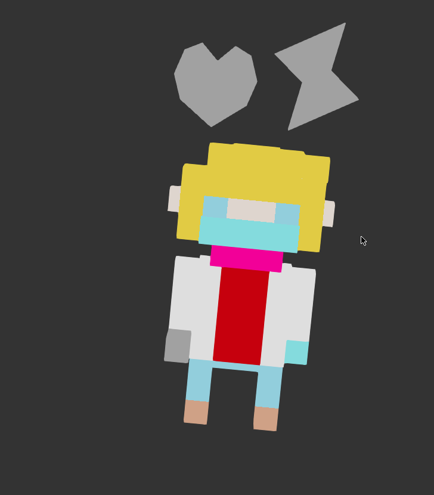

# Anyland Thing to GLTF

This project converts Anyland Things to GLTF. 
- Shapes are almost fully working.
- Materials are (mostly) working. 
Note: This project used to be Thing to OBJ but OBJ files are simply not good enough, so I reverse engineered (read the documentation) of GLTF which supports PBR materials (which is the main reason I switched.)

Current problems
- Materials are not fully fleshed out. The only fully working materials I know are default (obviously) and unshaded because my test json is almost all unshaded. 
- Images; Currently any texture that is not in RGBA mode (which is basically all of them) simply doesn't work. This also messes up the base color. 

Pictures: 

